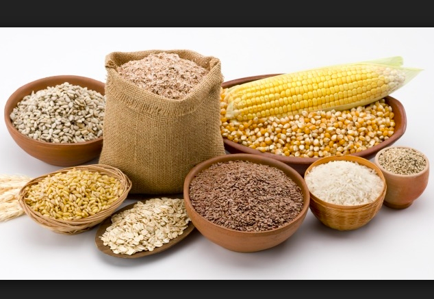
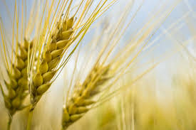
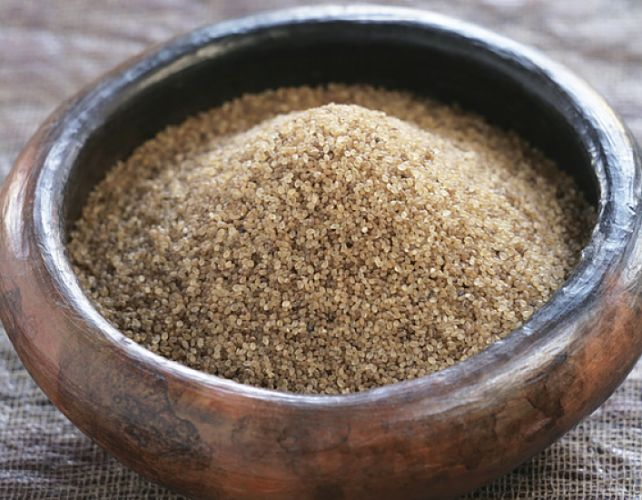
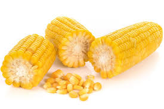
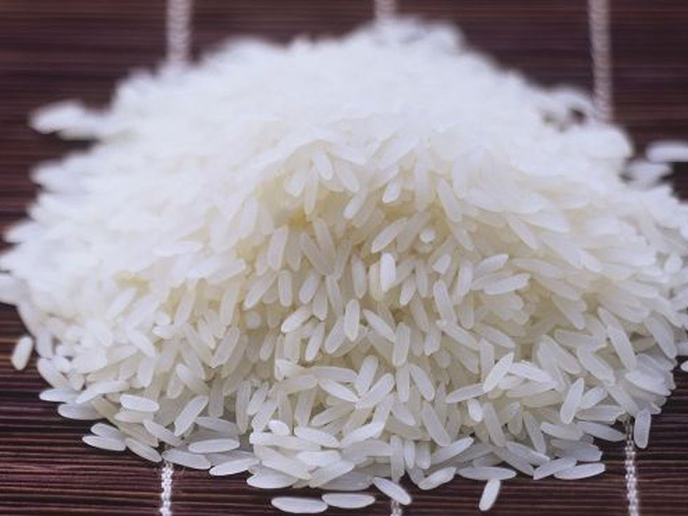
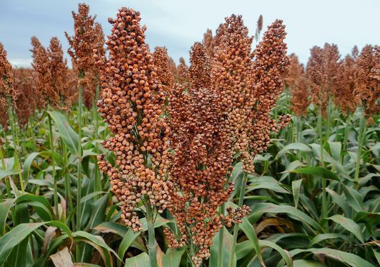

<html lang="en">
<head>
  <title>Bootstrap Example</title>
  <meta charset="utf-8">
  <meta name="viewport" content="width=device-width, initial-scale=1">
  <link rel="stylesheet" href="https://maxcdn.bootstrapcdn.com/bootstrap/4.4.1/css/bootstrap.min.css">
  
  
  

</head>
<body id= "colo">

<nav class="navbar navbar-expand-sm bg-dark navbar-dark">
  <!-- Brand -->
  
  

  <!-- Links -->
  <ul class="navbar-nav">
    <li class="nav-item">
      <a class="nav-link" href="index.html">HOME</a>
    </li>
    <li class="nav-item">
      <a class="nav-link" href="BartChartIndex.html">Stacked Bart Chart </a>
    </li>
  
   <li class="nav-item">
      <a class="nav-link" href="evolution.html"> Graphe évolutif </a>
    </li>
    
    <!-- Dropdown -->
    <li class="nav-item dropdown">
      <a class="nav-link dropdown-toggle" href="#" id="navbardrop" data-toggle="dropdown">
        Carte Graphique 
      </a>
      

        <a class="dropdown-item" href="importexport.html">Importation - exportation</a>
        <a class="dropdown-item" href="production.html"> Production </a>
      

    </li>
    
    <li class="nav-item">
      <a class="nav-link" href="propos.html"> A propos </a>
    </li>
    
  </ul>
</nav>
 
  

 
  <h3> Specifications </h3>
  
La demande alimentaire de la population ouest africaine est de plus en plus focalisée sur les
céréales. La consommation céréalière a donc triplé en moins de 30 ans, pendant que la
population a été multipliée par 2,5. Compte tenu des réalités sociales (subsahariennes), nous avons jugé bon d’effectuer nos visualisations sur six (06) céréales qui sont le Riz, le Sorgho, le Fonio, Le Mais, le Mil, le Blé. En plus de cela s’ajoute la période d’observation qui a été réduite sur les dix (10) dernières années en vue d’obtenir une visualisation plus crédible. 
 

<h5> Pour les différentes visualisations, utiliser la barre de menu pour y accéder, Nous precisons qu'elles sont toutes dynamiques.Par ailleurs nous précisions que les visualisations portant sur la quantité sont exprimées en tonnes et ceux portant sur la valeur en milliers de dollars. </h5> 
  
  
  
  
  
  
  

</body>
</html>
